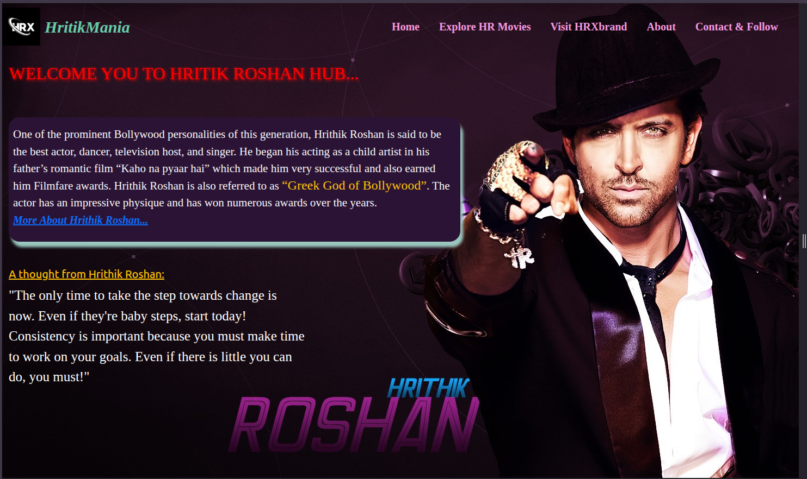
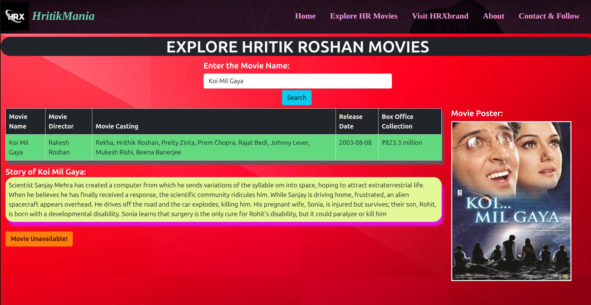
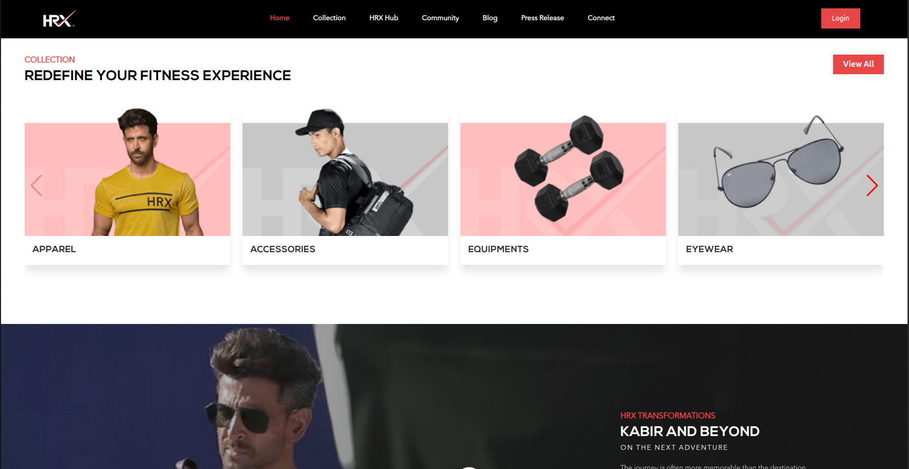

# HrithikMania 🎬

A full-stack fan-made website dedicated to Bollywood superstar **Hrithik Roshan** 🤗.

---

## 📦 Tech Stack & Tools

| Layer            | Stack Components                                     |
|------------------|------------------------------------------------------|
| Frontend         | React.js, Nginx                                      |
| Backend          | Django REST Framework (DRF), Gunicorn                |
| Database         | PostgreSQL (Dockerized)                              |
| Media Storage    | AWS S3 (`hritikmania-media`)                         |
| Infrastructure   | AWS EC2 (Ubuntu), Terraform                          |
| Configuration    | Ansible, Terraform                                   |
| Containerization | Docker, Docker Compose                               |
| Orchestration    | Kubernetes (tested locally)                          |
| Reverse Proxy    | Nginx (configured on EC2)                            |
| CI/CD            | GitHub Actions Workflows          |
| Deployment       | GitHub Actions + Ansible                             |
| DevOps Tools     | Docker, Ansible, Terraform, GitHub Actions           |

---

## 🌟 Features

- 🔍 Search Hrithik Roshan’s movies
- 📋 View full movie details:
  - Title, Director, Cast
  - Release Date, Box Office, Poster
  - Short Synopsis
- 🎥 Download Demo (for educational purposes)
- ☁️ Media files hosted on S3 bucket
- 🐳 Full Dockerized local environment
- ☸️ Kubernetes manifests (tested locally)
- 🚀 CI/CD pipeline with GitHub Actions + Ansible
- 🛡️ Infrastructure setup with Terraform
- 🌐 Nginx reverse proxy to serve backend on EC2

---

## 📁 Project Structure

```bash
HritikMania/
├── ansible/                        # Ansible Playbook for EC2 provisioning
│   ├── inventory.ini
│   └── playbook.yml
├── docker-compose.yml             # Dev setup with Docker Compose
├── .github/workflows/             # GitHub Actions: CI (docker-push.yml), CD (deploy.yml)
├── hritikmania-backend/           # Django API backend
│   ├── hritikmania-backend/       # Project settings
│   ├── movies/                    # App logic
│   ├── media/                     # Local media dir (ignored on server)
│   ├── requirements.txt
│   └── Dockerfile
├── hritikmania-frontend/          # React frontend
│   ├── src/
│   ├── public/
│   ├── nginx.conf
│   ├── Dockerfile
│   └── .env.production
├── kubernetes/                    # K8s manifests for frontend/backend/postgres
│   ├── backend-deployment.yaml
│   ├── frontend-service.yaml
│   ├── postgres-deployment.yaml
│   └── ...
├── terraform/                     # Infrastructure provisioning (S3, EC2, IAM)
│   ├── main.tf
│   ├── s3.tf
│   ├── s3_policy.json
│   ├── variables.tf
│   └── ...
├── screenshots/                   # UI screenshots
│   └── homepage.png
└── README.md
````

---

## ⚙️ Setup Guide

### 🐳 Docker Setup (Dev/Prod)

```bash
# Clone project
git clone https://github.com/yogeshGit11/HritikMania.git
cd HritikMania

# Start the app (frontend + backend + db)
docker-compose up --build -d
```

Access:

* Frontend: `http://localhost:3000`
* Backend API: `http://localhost:8000/api/`

---

### 🌐 Deployment to EC2 (Production)

#### ✅ Step 1: IAM Setup (Manual)

Before provisioning via Terraform, an IAM user `hritikmania_user` was manually created.
Its credentials (access key & secret) are used by Terraform for infrastructure provisioning.


#### ✅ Step 2: Terraform (Infrastructure)

```bash
cd terraform
terraform init
terraform apply  # Provisions EC2, S3 bucket, Security Groups
```

#### ✅ Step 3: Ansible (Server Provisioning)

```bash
cd ansible
ansible-playbook -i inventory.ini playbook.yml
```
#### 🛠️ One-time initial setup for the HritikMania application server (This is only intended for initial provisioning)

* Installs Docker, Docker Compose, and Nginx

* Adds GitHub to known SSH hosts and clones the project repository

* Copies necessary .env and data files to the server

* Runs Docker Compose to start containers


#### ✅ Step 4: CI/CD with GitHub Actions

* On **push to `dev`**:

  * Builds Docker images and pushes them to Docker Hub.

* On **push to `main`**:

  * SSH into EC2 and redeploys the app using Docker Compose.

---

## 🗂 Media Handling with AWS S3

* Bucket used: `hritikmania-media`
* Used for storing movie posters
* Configured in Django using `boto3 + django-storages`
* Public read access enabled via bucket policy

---

## ☸️ Kubernetes Setup (Local Only)

> Used for learning purposes and tested with `minikube`.
> Not used in production due to EC2 RAM limitations.

```bash
kubectl apply -f kubernetes/
```

Manifests include:

* Deployments + Services (frontend, backend, PostgreSQL)
* ConfigMap + Secret for environment variables
* Custom namespace declaration

---

## 🌐 Nginx Reverse Proxy (on EC2)
* Nginx is installed and configured directly on the EC2 instance (outside the Django project) to act as a reverse proxy.

* It forwards traffic from:

  * `http://<ec2-ip>/api/` → Django container
* Serves as a secure and production-like interface to backend.


---

## 📷 Screenshots
#### 🏠 Homepage

#### 🔍 Search page

#### 🌐 hrxbrand.com (external site)
This is an extrnal site(https://hrxbrand.com/home)


---

## 📌 Future Scope

* ✅ Enable HTTPS — Secure the website with SSL/TLS by configuring HTTPS (using Nginx, Certbot)

* 📈 Add monitoring (Prometheus & Grafana)

* ☁️ Explore production-grade K8s with EKS

* 🔁 Integrate Jenkins for automation pipelines

* 🎨 UI Improvements — Improve responsiveness and design
---

## ⚖️ Disclaimer

This is a **fan-made educational project**.
No copyrighted material is hosted.

---

## 📬 Contact

* GitHub: [Yogesh Chaudhari](https://github.com/yogeshGit11)
* Email: [ymali2434@gmail.com](mailto:ymali2434@gmail.com)

---

## 🙏 Final Note

Thanks for visiting this project! Built with ❤️ to learn and explore full DevOps practices from scratch — with zero paid services, using open-source tools, clean automation, and cloud-native setups.

---